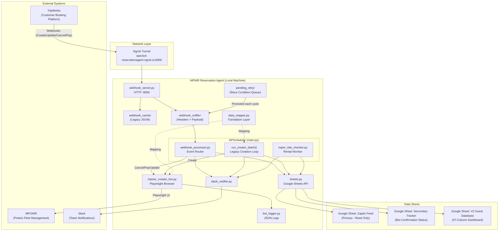

# MPWR Reservation Agent — Complete System Documentation

**Version**: 2.2 (Waiver Tracking & Minor Update Bypass)
**Last Updated**: April 17, 2026 (Morning)
**Maintainer**: Epic 4x4 Adventures Engineering

---

## Table of Contents

1. [System Overview](#system-overview)
2. [Architecture Diagram](#architecture-diagram)
3. [Data Flow: End-to-End Lifecycle](#data-flow)
4. [File Reference](#file-reference)
5. [Configuration & Environment](#configuration)
6. [Module Deep Dive](#module-deep-dive)
7. [Supported Operations](#supported-operations)
8. [Activity & Vehicle Mapping Tables](#mapping-tables)
9. [Slack Notification Reference](#slack-reference)
10. [Safety Mechanisms](#safety-mechanisms)
11. [Known Limitations](#known-limitations)
12. [Startup & Deployment](#startup)
13. [Troubleshooting Guide](#troubleshooting)

---

## 1. System Overview

The MPWR Reservation Agent is a fully autonomous system that synchronizes reservations between **TripWorks** (the customer-facing booking platform) and **MPOWR** (the Polaris fleet management system used by Epic 4x4 Adventures).

### What It Does

| Capability | Description |
|---|---|
| **Create Reservations** | When a customer books on TripWorks, the agent automatically creates the matching reservation in MPOWR |
| **Cancel Reservations** | When a booking is cancelled in TripWorks, the agent cancels it in MPOWR (Customer Reason, no fee) |
| **Reschedule/Update** | When dates, vehicles, or activity types change in TripWorks, the agent updates the MPOWR reservation |
| **Settle Payments** | *DISABLED* — Epic 4x4 settles in cash only. The bot never puts customer card info into MPOWR |
| **Monitor Rental Status** | Periodically checks MPOWR for rental status changes (Checked Out, Returned, etc.) |
| **Guest Database Sync** | Maintains a V2 Guest Database in Google Sheets with 47+ columns of normalized data |

### What It Does NOT Do

- Store or process credit card information in MPOWR (all settlements use Cash)
- Charge cancellation fees (always selects "Customer Reason" and ensures fee is $0)
- Process partial payments (only acts when TripWorks balance is fully paid)
- Create reservations for test bookings, TripAdvisor Exclusives, Pro XPeriences, or Guide Car Passengers

---

## 2. Architecture Diagram



---

## 3. Data Flow: End-to-End Lifecycle

### 3.1 New Booking (Creation)

```
Customer books on TripWorks
  -> TripWorks fires webhook POST to ngrok endpoint
  -> webhook_server.py saves to webhook_cache/{CONF_CODE}.json AND webhook_sniffer/
  -> Zapier detects TripWorks event, appends row to Google Sheet (Zapier Feed)
  -> main.py scheduler triggers run_creator_batch() every 5 minutes
  -> sheets.py scans Google Sheet for rows without MPWR Confirmation
  -> data_mapper.py translates row -> MPOWR form values
  -> mpowr_creator_bot.py opens Chromium, logs into MPOWR, fills form, submits
  -> Bot extracts MPOWR Confirmation ID from success page
  -> sheets.py writes ID to Secondary Tracker + V2 Guest Database
  -> slack_notifier.py sends success DM with screenshot
```

### 3.2 Cancellation

```
Staff/customer cancels in TripWorks
  -> TripWorks fires webhook with status.slug = "cancelled"
  -> webhook_server.py saves to webhook_sniffer/
  -> webhook_processor.py detects cancellation via slug check
  -> Looks up MPWR Confirmation Number in V2 Guest Database
  -> mpowr_creator_bot.cancel_reservation(mpwr_id):
      1. Navigate to /orders/{mpwr_id}
      2. Click "Actions" -> "Cancel Reservation"
      3. Select "Customer Reason"
      4. Ensure "Charge Cancellation Fee" is UNCHECKED
      5. Click "Cancel Order"
  -> sheets.py updates V2 Dashboard: MPWR Status = "Canceled"
  -> Slack notification sent
```

### 3.3 Reschedule / Update / Waiver Bypass

```
Staff/customer changes dates in TripWorks OR customer signs a Waiver
  -> TripWorks fires webhook with status.slug = "booked" (same as creation!)
  -> webhook_processor.py checks V2 Database -- finds existing MPWR ID
  -> Classifies as UPDATE (not creation, since MPWR ID already exists)
  -> Extracts new dates, vehicle, pricing, and waiver counts from webhook payload
  -> Compares core details (Date, Time, Net Price) against V2 Dashboard snapshot
  -> IF CORE DETAILS MATCH (Minor Update / Waiver Signed):
      1. Bypasses Playwright/MPOWR completely!
      2. Updates Dashboard with "Epic Waivers Complete" + "Epic Waivers Expected"
      3. Sends customized "Minor Update" Slack alert
  -> IF CORE DETAILS CHANGED (True Reschedule):
      1. mpowr_creator_bot.update_reservation(mpwr_id, new_payload) opens Chrome
      2. Navigates to /orders/{mpwr_id} -> "Actions" -> "Reschedule"
      3. Selects correct activity listing
      4. Sets new start/end dates and times
      5. "The Great Reset" -- zero out ALL existing vehicle dropdowns
      6. Sets new vehicle type and quantity
      7. Clicks "Update Reservation"
      8. Updates V2 Dashboard with new dates/pricing + waivers metrics
      9. Slack notification sent
```

### 3.4 Payment Settlement (DISABLED)

> **NOTE**: Payment auto-settle is intentionally DISABLED. Epic 4x4 settles all payments
> in cash with MPOWR and never puts customer card information into the system.
> TripWorks "payment" webhooks are processed as normal booking confirmations.
> The `settle_payment()` method still exists in the bot for potential future use.

---

## 4. File Reference

| File | Lines | Purpose |
|---|---|---|
| `main.py` | 277 | Daemon orchestrator with APScheduler cron jobs |
| `webhook_server.py` | 79 | HTTP POST listener on port 8000 |
| `webhook_processor.py` | ~240 | Smart event router (Cancel/Pay/Update dispatcher) |
| `mpowr_creator_bot.py` | ~2050 | Core Playwright UI automation engine |
| `mpowr_login.py` | 81 | Shared MPOWR SSO authentication |
| `data_mapper.py` | 875 | TripWorks to MPOWR translation (activities, vehicles, pricing) |
| `sheets.py` | 571 | Google Sheets read/write (3 sheets) |
| `slack_notifier.py` | ~510 | Slack Block Kit notifications + screenshot uploads |
| `bot_logger.py` | 105 | Dual-output JSON + console logger with daily rotation |
| `mpwr_ride_checker.py` | 108 | Rental status scraper (Checked In to Returned tracking) |
| `Run_Live_Bot.bat` | 28 | Windows launcher (venv, ngrok, webhook server, daemon) |
| `requirements.txt` | 9 | Python dependencies |
| `.env` | ~17 | Credentials and configuration |

### Directory Structure

```
MPWR_Reservation_Agent/
|-- .env                          # Credentials (NEVER commit)
|-- Run_Live_Bot.bat              # One-click Windows launcher
|-- main.py                       # Daemon entry point
|-- webhook_server.py             # HTTP listener
|-- webhook_processor.py          # Event router
|-- mpowr_creator_bot.py          # Playwright engine
|-- mpowr_login.py                # MPOWR authentication
|-- data_mapper.py                # Data translation layer
|-- sheets.py                     # Google Sheets integration
|-- slack_notifier.py             # Slack notifications
|-- bot_logger.py                 # Structured logging
|-- mpwr_ride_checker.py          # Rental status monitor
|-- requirements.txt              # Python dependencies
|-- authorized_user.json          # Google OAuth token (auto-generated)
|-- mpowr_form_selectors.json     # Cached MPOWR DOM selectors
|-- venv/                         # Python virtual environment
|-- logs/                         # JSON log files (rotated daily)
|-- screenshots/                  # Diagnostic screenshots (cleaned weekly)
|-- webhook_cache/                # Legacy webhook JSON (per confirmation code)
|-- webhook_sniffer/              # All webhook payloads (timestamped)
    |-- processed/                # Successfully handled webhooks
    |   |-- processed_hashes.txt  # MD5 deduplication database
    |-- pending_retry/            # Race condition queue
```

---

## 5. Configuration and Environment

### Required .env Variables

| Variable | Purpose | Example |
|---|---|---|
| `MPOWR_EMAIL` | MPOWR login email | `admin@epic4x4adventures.com` |
| `MPOWR_PASSWORD` | MPOWR login password | `(secret)` |
| `GOOGLE_APPLICATION_CREDENTIALS` | Path to Google OAuth client secret JSON | `./client_secret.json` |
| `GOOGLE_SHEET_ID` | Zapier feed sheet (primary, read-only) | `1ABC...xyz` |
| `SECONDARY_SHEET_ID` | Bot confirmation tracker | `1DEF...xyz` |
| `DASHBOARD_SHEET_ID` | V2 Guest Database (47-column) | `1GHI...xyz` |
| `SLACK_WEBHOOK_URL` | Slack incoming webhook URL | `https://hooks.slack.com/...` |
| `SLACK_BOT_TOKEN` | Slack bot token (for file uploads) | `xoxb-...` |
| `SLACK_USER_ID` | Slack user to DM | `U12345678` |
| `DRY_RUN` | If "true", fills forms but does not submit | `false` |
| `CREATOR_HEADLESS` | If "true", runs Chromium without a visible window | `true` |
| `START_ROW` | Row to start scanning from in Google Sheet | `918` |

---

## 6. Module Deep Dive

### main.py -- Daemon Orchestrator

The entry point for the entire system. Uses **APScheduler** (`BlockingScheduler`) with Denver timezone to run jobs on cron schedules.

**Scheduler Configuration:**

| Job | Schedule | Function |
|---|---|---|
| Creator (Peak) | Every 5 min, 7AM-6:59PM | `run_creator_safely()` |
| Creator (Off-Peak) | Every 60 min, 7PM-6:59AM | `run_creator_safely()` |
| Ride Checker | Every 30 min (HH:00, HH:30) | `run_ride_checker()` |

**`run_creator_safely()` executes in order:**
1. `process_webhooks()` -- Sweep sniffer for cancels/pays/updates
2. `run_creator_batch()` -- Scan Google Sheet for new bookings

**`run_creator_batch()` flow:**
1. Clean up old webhook cache and screenshots
2. Scan Google Sheet for pending rows (max 20 per run)
3. Build payloads via `data_mapper.py`
4. Filter out intentional skips (test bookings, guide passengers, etc.)
5. Launch `MpowrCreatorBot` and call `create_batch()`
6. Write results to Secondary Sheet + V2 Guest Database
7. Send Slack notifications for each outcome

---

### webhook_server.py -- HTTP Listener

A lightweight `BaseHTTPRequestHandler` server running on **port 8000**, exposed via ngrok at `epic4x4-reservationagent.ngrok.io`.

**On every POST request:**
1. Parses JSON payload
2. Saves to `webhook_cache/{confirmation_code}.json` (legacy compatibility)
3. Saves to `webhook_sniffer/{timestamp}_{confirmation_code}.json` with full HTTP headers
4. Returns HTTP 200

Non-JSON payloads are saved to `webhook_sniffer/bad_{timestamp}.txt` for debugging.

---

### webhook_processor.py -- Event Router

The brain of the webhook-driven system. Sweeps `webhook_sniffer/` and classifies events.

**Processing Pipeline:**

```
For each .json file in webhook_sniffer/:
  1. Read and parse payload
  2. Hash payload (MD5) -- skip if already processed (deduplication)
  3. Extract TW Confirmation Code
  4. Detect cancellation (status.slug == "cancelled")
     NOTE: Payment auto-settle has been DISABLED (cash settlements only)
  5. Query V2 Guest Database for existing MPWR ID
  6. If no MPWR ID found:
     -> ALL webhooks move to pending_retry/ (not just cancel)
     -> 1-hour TTL prevents infinite retry loops
  7. If MPWR ID found, classify:
     - Cancel (status.slug == "cancelled") -> cancel_reservation()
     - Update (status.slug == "booked") -> update_reservation()
  8. Record hash to prevent re-processing
  9. Move file to processed/
```

**Retry Promotion:** At the start of each sweep, files in `pending_retry/` are moved back into the main queue for re-evaluation. Files older than 1 hour are expired to `processed/` to prevent infinite loops.

**Stale Webhook Flush:** After a successful MPOWR creation, `main.py` calls `_flush_stale_sniffer_files()` to move all old sniffer/retry files for that TW confirmation to `processed/`. This prevents stale creation webhooks from being misidentified as "updates" on the next cycle.

---

### mpowr_creator_bot.py -- Playwright Automation Engine

The largest module (~2050 lines). Controls a headless Chromium browser to interact with the MPOWR web interface.

**Core Methods:**

| Method | Purpose |
|---|---|
| `create_batch(payloads)` | Creates multiple reservations sequentially |
| `create_reservation(payload)` | Fills and submits the /orders/create form |
| `cancel_reservation(mpwr_id)` | Actions -> Cancel -> Customer Reason -> $0 fee -> Cancel Order |
| `settle_payment(mpwr_id)` | Actions -> New Charge -> Cash -> Collect |
| `update_reservation(mpwr_id, payload)` | Actions -> Reschedule -> Great Reset -> Re-apply -> Update |

**Key Internal Methods:**

| Method | Purpose |
|---|---|
| `_handle_listing_selection()` | Selects activity from MPOWR dropdown (scrolls to find) |
| `_handle_date_selection()` | Calendar navigation with month/year arrow clicking |
| `_handle_time_selection()` | Listbox time picker with fuzzy matching |
| `_handle_vehicle_selection()` | Vehicle card qty dropdown (exact text match with negative lookahead regex fallback) |
| `_handle_guide_addons()` | Tour guide service selection with search-and-add |
| `_handle_insurance_selection()` | AdventureAssure selection |
| `_override_price()` | Post-creation price adjustment to match TripWorks |
| `_screenshot()` | Diagnostic screenshot capture |

**"The Great Reset" (Update only):**
When editing a reservation, the bot first sets ALL vehicle quantity dropdowns to 0 before applying new selections. This prevents accidentally double-booking vehicles when a customer switches models. Includes a keyboard fallback if MPOWR ever replaces native `<select>` elements with custom UI components.

**Safety Features:**
- `MAX_CONSECUTIVE_FAILURES = 3` -- aborts batch if 3 reservations fail in a row
- Every error path captures a screenshot to `screenshots/`
- DRY_RUN mode fills forms but never clicks Submit/Update/Cancel

---

### mpowr_login.py -- Authentication

Handles the MPOWR SSO login flow:
1. Navigate to `https://mpwr-hq.poladv.com/orders`
2. Click pre-SSO gateway button (`button.bg-polaris-600`) if present
3. Fill `#username` and `#password`
4. Click `button.js-branded-button`
5. Wait for URL to match `**/orders**`

Retries up to 2 times with 3-second delays. Raises `MpowrLoginError` on failure.

---

### data_mapper.py -- Translation Layer

Translates between TripWorks/Google Sheet terminology and MPOWR form values. Contains 875 lines of mapping tables and conversion logic.

**Key Mapping Tables:**

| Map | From -> To |
|---|---|
| `TOUR_ACTIVITY_MAP` | Sheet Activity names -> MPOWR listing names |
| `RENTAL_DURATION_MAP` | Ticket Type durations -> MPOWR rental activity names |
| `VEHICLE_MODEL_MAP` | Internal model codes -> MPOWR vehicle card text |
| `RENTAL_VEHICLE_MAP` | TripWorks rental activity names -> internal model codes |

**Key Functions:**

| Function | Purpose |
|---|---|
| `build_customer_payloads_from_row()` | Master builder: Sheet row -> bot payload |
| `get_mpowr_activity()` | Determines which MPOWR listing to select |
| `get_mpowr_vehicle()` | Determines which vehicle card to configure |
| `parse_ticket_type()` | Extracts model, qty, duration, guide breakdown from Ticket Type |
| `parse_subtotal()` | Converts currency strings/cents to dollar floats |
| `select_best_time_slot()` | Finds nearest matching MPOWR time slot |
| `map_legacy_to_dashboard()` | Builds 47-column V2 Dashboard row from Sheet + webhook data |
| `build_webhook_email()` | Creates `polaris+{CONF}@epic4x4adventures.com` linking email |

**Intentional Skip Rules:**
The bot intentionally skips (and Slack-notifies) these reservation types:
- Test reservations (first/last name contains "test")
- TripAdvisor Exclusive activities (managed natively)
- Pro XPerience activities (no MPOWR inventory needed)
- Guide Car Passengers/Riders (no vehicle allocation)

---

### sheets.py -- Google Sheets Integration

Manages three separate Google Sheets:

| Sheet | Variable | Purpose |
|---|---|---|
| Zapier Feed | `GOOGLE_SHEET_ID` | Primary data source (read-only by bot) |
| Secondary Tracker | `SECONDARY_SHEET_ID` | Tracks which TW Confirmations have been processed |
| V2 Guest Database | `DASHBOARD_SHEET_ID` | 47-column normalized database |

**Key Functions:**

| Function | Purpose |
|---|---|
| `scan_for_pending_creations()` | Finds rows needing MPOWR reservations (max 20/run) |
| `log_secondary_state()` | Writes bot confirmation status to tracker |
| `write_dashboard_row()` | Appends new row to V2 Guest Database |
| `update_dashboard_row()` | Mutates existing row in-place (for cancels/updates/payments) |
| `fetch_active_rentals_to_check()` | Gets checked-in rentals for status monitoring |
| `execute_with_backoff()` | Wraps all API calls with exponential backoff for 429 errors |

**Scanning Rules:**
A row is "pending" if:
1. First Name and Last Name are non-empty
2. Activity Date is present and NOT in the past
3. TW Confirmation is not already in the Secondary Tracker
4. Row index >= `START_ROW` from .env

---

### slack_notifier.py -- Team Notifications

Sends rich Block Kit messages via Slack Bot Token (preferred) or Incoming Webhook (fallback). Falls back to console logging if neither is configured.

**Notification Types:**

| Method | Icon | When |
|---|---|---|
| `send_reservation_success()` | check | Reservation created with MPOWR link |
| `send_error_alert()` | x | Creation failed with error details |
| `send_duplicate_alert()` | warning | Existing MPOWR ID found, skipped |
| `send_dry_run_alert()` | test tube | Form filled but not submitted |
| `send_price_override_alert()` | money | Price discrepancy detected |
| `send_success_summary()` | chart | End-of-batch totals |
| `send_message()` | (varies) | Generic text (used by webhook_processor) |

**Screenshot Upload Flow:**
Uses Slack's modern 3-step file upload API:
1. `files.getUploadURLExternal` -> get temporary URL + file ID
2. POST file bytes to temporary URL
3. `files.completeUploadExternal` -> share in channel

---

### bot_logger.py -- Structured Logging

Dual-output logger:
- **Console**: Human-readable, emoji-based (matches existing print style)
- **File**: JSON-lines format in `logs/mpowr_bot.log`

Rotates daily at midnight, keeps 30 days of history. Each entry contains timestamp, level, message, and optional context fields.

---

### mpwr_ride_checker.py -- Rental Status Monitor

Runs every 30 minutes. For each "Checked In" rental in the V2 Database:
1. Navigates to the MPOWR reservation page
2. Scrapes the status pill (`span.inline-flex.rounded`)
3. If status changed, updates the Dashboard sheet
4. Includes randomized jitter (2-6 seconds) between checks to avoid rate limiting

---

## 7. Supported Operations

### Tours

| TripWorks Activity | MPOWR Listing | Vehicle |
|---|---|---|
| Gateway to Hell's Revenge and Fins N' Things | Hell's Revenge | RZR XP4 S |
| Hell's Revenge - Pro R Ultimate Experience | Hell's Revenge | RZR Pro R |
| Hell's Revenge and Fins N' Things - Private | Hell's Revenge | RZR XP4 S |
| Private Pro R - Hell's Revenge | Hell's Revenge | RZR Pro R |
| Pro R - Adult Hell's | Hell's Revenge | RZR Pro R |
| Poison Spider - Private | Poison Spider Mesa | (from ticket) |
| Poison Spider Mesa Tour | Poison Spider Mesa | (from ticket) |
| Moab Discovery Tour | Moab Discovery Tour | XPEDITION XP 5 NorthStar |

### Rentals

| Duration | MPOWR Listing |
|---|---|
| 3 Hours / 3 Hour / 3hr | 3 Hour Self-Guided Adventure Rental |
| Half-Day Up to 5 Hours | Half-Day Self-Guided Rental |
| Full-Day Up to 9 Hours | Full-Day Adventure |
| 24 Hours | 24 Hour Rental |
| 2-Day through 7-Day | Multi-Day Adventure Rental |

### Vehicles

| MPOWR Card Text | Seats | Notes |
|---|---|---|
| RZR XP4 S | 4 | Default for tours, $159/tour |
| RZR XP S | 2 | Rentals only |
| RZR Pro R | 2 | Premium tours, $205/tour |
| RZR PRO S | 2 | "Turbo Pro S" in TripWorks |
| RZR PRO S4 | 4 | 4-seat Pro S |
| XPEDITION XP 5 NorthStar | 5 | Moab Discovery only |

---

## 8. Slack Notification Reference

| Icon | Tag | Meaning |
|---|---|---|
| Check mark | `[SYSTEM AUTOMATION]` | Operation completed successfully |
| Red X | `MPOWR Auto-Creation Failed` | Creation failed, manual action needed |
| Warning | `[MPOWR PAYMENT FAILURE]` | Payment settlement failed |
| Warning | `[MPOWR EDIT FAILURE]` | Reschedule/update failed |
| Siren | `[MPOWR CANCEL FAILURE]` | Cancellation failed -- inventory at risk |
| Skip | `[SKIPPED]` | Intentionally skipped (partial payment, mapping failure) |
| Skip | `[INTENTIONAL OPERATION]` | Cancel/Pay executed as designed |
| Test tube | `DRY RUN` | Form filled but not submitted |
| Money | `Price Discrepancy` | MPOWR vs TripWorks price mismatch |
| Warning | `[WEBHOOK PROCESSING ERROR]` | Critical JSON parsing failure |

---

## 9. Safety Mechanisms

### Webhook Deduplication
TripWorks sends 5-10 identical webhooks per event. The processor hashes each payload with MD5 and checks against `processed_hashes.txt`. Identical payloads are silently skipped.

### Race Condition Protection
ALL webhooks without a matching MPWR ID in the Dashboard DB go to `pending_retry/` instead of being discarded. Each 5-minute cycle promotes retry files back into the main queue. A 1-hour TTL expires old retry files to prevent infinite loops.

### Stale Webhook Flush
After a successful MPOWR creation + Dashboard DB push, `_flush_stale_sniffer_files()` cleans up all old sniffer/retry files for that TW confirmation. This prevents stale creation webhooks from being misidentified as "updates" on the next cycle.

### The Great Reset
During updates, ALL vehicle dropdowns are zeroed before applying new selections. Prevents double-booking when customers switch vehicle types. Includes a keyboard-input fallback if MPOWR ever replaces native HTML select elements with custom Headless UI components.

### Cancellation Fee Guard
Uses Playwright's `.uncheck()` which only acts if the checkbox is currently checked. If already unchecked (the default), it does nothing -- preventing accidental checking.

### Batch Size Cap
Maximum 20 reservations per 5-minute cycle. Prevents session timeouts and runaway API consumption.

### Past Date Filter
Reservations with Activity Dates in the past are automatically skipped, preventing the bot from creating bookings that can never be fulfilled.

### Consecutive Failure Circuit Breaker
After 3 consecutive failures in a batch, the bot aborts the remaining queue to prevent cascading errors.

### Screenshot Forensics
Every error path captures a full-page screenshot for post-mortem analysis. Screenshots are auto-cleaned after 7 days.

### Legacy Fallback
The webhook-driven system runs in parallel with the original Google Sheet polling. If webhooks fail, the legacy system continues operating independently.

---

## 10. Known Limitations

1. **MPOWR UI Sensitivity**: All Playwright automation relies on specific button text and CSS selectors. If Polaris updates the MPOWR UI, selectors may need updating.

2. **Hash File Growth**: `processed_hashes.txt` grows indefinitely. Consider periodic cleanup of entries older than 30 days.

3. **Retry File TTL**: Files in `pending_retry/` now have a 1-hour TTL. After 1 hour they are automatically expired to `processed/`.

4. **Single Machine**: The system runs on a single local Windows machine. If the machine is off, webhooks queue in ngrok but are lost after the tunnel disconnects.

5. **Undocumented TripWorks API**: All webhook event classification is reverse-engineered. TripWorks may change payload structures without notice.

6. **No Multi-Vehicle Update**: The update flow assumes a single vehicle type per reservation. Multi-vehicle reservations with different models are not yet supported in the update path.

---

## 11. Startup and Deployment

### First-Time Setup
1. Clone repository to local Windows machine
2. Create `.env` file with all required variables
3. Place Google OAuth `client_secret.json` in project root
4. Double-click `Run_Live_Bot.bat`
   - Auto-creates Python virtual environment
   - Installs all dependencies from `requirements.txt`
   - Installs Playwright Chromium browser
   - Starts ngrok tunnel, webhook server, and main daemon

### Daily Operation
Double-click `Run_Live_Bot.bat`. The system:
1. Activates virtual environment
2. Starts **ngrok** tunnel (persistent domain: `epic4x4-reservationagent.ngrok.io`)
3. Starts **webhook server** on port 8000 in a separate window
4. Starts **main daemon** with APScheduler
5. Runs initial boot sweep immediately
6. Then operates on cron schedule indefinitely

### Stopping
Close the terminal window or press `Ctrl+C`.

### Dependencies
```
playwright
gspread
google-auth
google-auth-oauthlib
google-auth-httplib2
requests
python-dotenv
pytz
apscheduler
```

---

## 12. Troubleshooting Guide

| Symptom | Likely Cause | Fix |
|---|---|---|
| No Slack notifications at all | `.env` missing Slack vars | Add `SLACK_WEBHOOK_URL` and/or `SLACK_BOT_TOKEN` |
| "No pending creations found" every cycle | `START_ROW` too high, or all rows already processed | Check `START_ROW` in `.env` and Secondary Sheet |
| Bot creates old reservations on restart | `START_ROW` not set correctly | Set to current row count + 1 |
| Login fails repeatedly | MPOWR changed SSO flow | Check `mpowr_login.py` selectors |
| Vehicle selection wrong | New vehicle model added | Update `VEHICLE_MODEL_MAP` in `data_mapper.py` |
| Cancel/Pay webhook stuck in pending_retry | Creation has not completed yet | Wait for next cycle, or manually move file |
| "Charge cancelation fee" checkbox issue | MPOWR changed UI | Check `cancel_reservation()` selectors |
| Screenshots piling up | Cleanup not running | Verify `cleanup_old_screenshots()` in main.py boot sequence |
| Google Sheets 429 errors | API quota exceeded | `execute_with_backoff()` handles this automatically |
| Webhook server not receiving | Ngrok tunnel disconnected | Restart `Run_Live_Bot.bat` |
| Bot crashes with AttributeError | Module API changed | Check imports and method names in affected file |
| Multiple identical Slack messages | TripWorks webhook spam | Hash deduplication should handle -- check `processed_hashes.txt` |

---

*This document covers the complete MPWR Reservation Agent system as of April 16, 2026 (v2.1 — Race Condition Fix Release). For questions or updates, contact the engineering team.*
